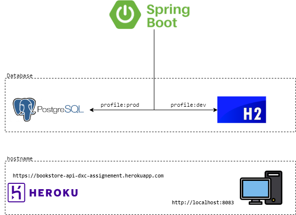
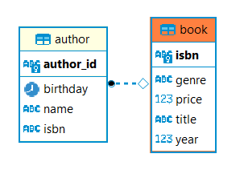

# Assigment for DXC technical assessment

### Architecture diagram illustration



### DB diagram illustration


### [View requirement (.docx)](./src/main/resources/Bookstore%20API%20(Design).docx)
### [Postman collection (import into Postman)](./src/main/resources/dxc-assignment-bookstore-api.postman_collection.json)

<details>
<summary>We have also pre-loaded data for user to begin search / update / delete query:</summary><br>

    [
      {
        "isbn": "11e89a80-5454-4244-8379-0209cfd5d1a8",
        "title": "Ghostbusters",
        "author": [
          {
            "name": "John",
            "birthday": "30-08-1985"
          },
          {
            "name": "Bob",
            "birthday": "30-08-1970"
          }
        ],
        "year": 2000,
        "price": 25.5,
        "genre": "Horror"
      },
      {
        "isbn": "b93861d7-c4d4-4d45-ad4f-38341793a5a2",
        "title": "Stock trading",
        "author": [
          {
            "name": "Peter",
            "birthday": "30-08-1995"
          },
          {
            "name": "Adam",
            "birthday": "30-08-1971"
          }
        ],
        "year": 2000,
        "price": 75.2,
        "genre": "Finance"
      }
    ]

</details>  


Hostname for localhost: `http://localhost:8083`  
Hostname for production: `https://bookstore-api-dxc-assignement.herokuapp.com`  

### How to use?

1. Simply clone this git and run as Spring application. 
2. You may choose dev or prod profile - no difference except for DB (refer to diagram above). 
3. Use the localhost value as your hostname (listed ABOVE). 
4. Import the postman collections and ready to use!
5. As this is secured API, you must enter your credentials under basic auth:  
```
ROLES_USER
username: user
password: password
          
ROLES_ADMIN
username: admin
password: password
```
6. operations with assigned roles:

```
•	Add a new book - ROLES_USER
•	Update book - ROLES_USER
•	Find books by title and/or author (Exact Match) - ROLES_USER
•	Delete book (Restricted permission) - ROLES_ADMIN

```
7. If you are using production url, you may skip step 1, 2 & 3
8. Too lazy to go through the steps? Wish you could just test it right away on any device? Good news! Swagger to the rescue! Just hit this url on any device! Make sure you enter the credentials given above
```
    https://bookstore-api-dxc-assignement.herokuapp.com/swagger-ui/index.html
```
8. For any issues, email me at norulshahlam@gmail.com or whatsapp me at +6592212152

### HAPPY CODING!